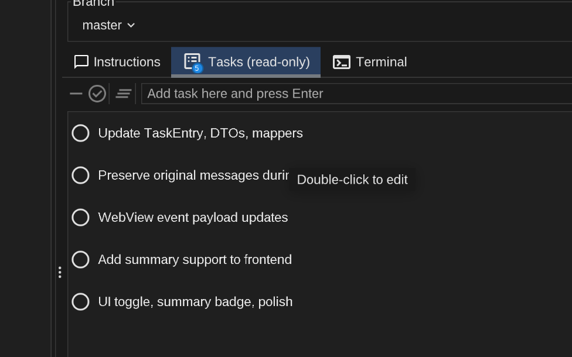

<p align="center">
  
</p>

<p align="center">
  <a href="https://brokk.ai">Website</a> •
  <a href="https://brokk.ai/documentation/introduction">Docs</a> •
  <a href="https://discord.com/invite/qYQ2Zg2PX7">Discord</a> •
  <a href="https://blog.brokk.ai">Blog</a> •
  <a href="https://www.youtube.com/@Brokk_AI">YouTube</a> •
  <a href="https://github.com/BrokkAi/brokk/releases">Download</a> •
  <a href="#getting-started">Getting Started</a>
</p>

<p align="center">
  <a href="https://brokk.ai/documentation/introduction"></a>
  <a href="https://discord.com/invite/qYQ2Zg2PX7"></a>
  <a href="https://blog.brokk.ai"></a>
  <a href="https://www.youtube.com/@Brokk_AI"></a>
  <a href="https://brokk.ai/power-ranking"></a>
  <a href="https://github.com/BrokkAi/brokk/stargazers"></a>
  <a href="https://github.com/BrokkAi/brokk/blob/master/LICENSE"></a>
</p>


# Brokk — AI-native code platform for million-line repos

Brokk keeps LLMs on-task in large codebases with fragment-level context, code intelligence, and agentic Lutz Mode for fast, explainable edits.

<p align="center">
   prune -> note/discard -> workspace ready" width="1080">
</p>

## Why Brokk is different

- **Fragment-level context, not file blobs**
  - Classes, methods, functions, summaries, exception traces, URLs, images, pasted text, issues, PRs, notes, and discard records are first-class fragments.

- **No black boxes: persistent, branchable history**
  - You never lose context. Every fragment and edit is persisted with undo/redo and you can branch from any past step.

- **Modes for speed or control**
  - EZ Mode (Lutz with auto task list execution) for hands-free flow; Advanced Mode when you want granular control.

- **Agentic Lutz Mode**
  - ContextAgent collects; SearchAgent expands and prunes; the Workspace becomes working memory. Keep/Forget/Note decisions are explicit and traceable.

- **Built for enterprise scale**
  - Dependency decompilation to source, incremental Java compiler for a tight edit-compile-test loop, BlitzForge mass refactors, and MergeAgent for conflict resolution.

## Brokk Power Ranking (BPR)

The Brokk Power Ranking is an open benchmark of 93 real-world coding tasks drawn from large Java repositories.

- Public results and methodology: https://brokk.ai/power-ranking
- Measures how different models handle long, messy, real tasks with full edit-and-test loops.

In the Brokk app, a BPR meter appears above the Instructions panel (for example, "BPR: 93%") and adapts to:
- the model you selected
- the current context size for the task

This gives a quick "fitness for this task" indicator so you can choose the best cost/performance model before you start the coding loop.

<p align="center">
  
</p>

## How it works (20 seconds)

1. Describe your goal or question in natural language.
2. ContextAgent pulls in the minimal set of relevant fragments: classes, methods, summaries, tests, stack traces, URLs, and images.
3. SearchAgent expands and prunes the Workspace, discarding irrelevant fragments and promoting key details into Notes.
4. Lutz Mode synthesizes an outcome: an answer, a direct code edit, or a task list for complex changes that you can execute one-by-one and tweak as needed.
5. Brokk applies edits and runs builds/tests in a tight loop, feeding failures and diffs back to the model.
6. You review, commit, branch, and reuse sessions with full visibility into what the AI saw and changed.

<p align="center">
  
</p>

## Highlights

- **Context Engineering**
  - Fragment-level context: summaries, classes, methods, functions, images, markdown, URLs, stack traces, notes, and discard-context fragments.
  - URL fragments load pages as Markdown and are persisted in history with a link to the source.
  - Search Agent: symbol-, type-, and structure-aware search that understands usage patterns across the project and dependencies.
  - Exception and stack-trace fragments are enriched with metadata and linked code locations for faster root-cause navigation.
  - Structured tasks with Lutz Mode: define goals and constraints; Brokk collects, prunes, and readies the workspace with explicit Keep/Forget/Note decisions.

- **Workspace & Preview**
  - Workspace as working memory: Keep/Forget/Note operations with explicit, inspectable history.
  - Preview windows with search, quick edits, and promotion of selections into first-class fragments.

- **Git Integration**
  - Capture diffs, commits, and PRs as context; generate on-the-fly diffs for regressions.
  - First-class Git worktrees for parallel task branches and fast context switching.
  - PR review workflow: load PR diffs/comments as context, propose fixes, and push follow-up commits.
  - Automate the boring bits: optional auto-commit and auto-PR creation with change summaries; you stay in control.

- **Edit Loop**
  - Automatic compile/lint after code changes via an incremental Java compiler.
  - Run tests from the Workspace; failures are streamed directly back to the LLM.

- **BlitzForge**
  - Apply instructions across dozens or hundreds of files in parallel, with per-file context and a final holistic pass.

- **MergeAgent**
  - Resolve conflicts using blame-aware strategies that preserve intent from both sides with minimal manual editing.

- **Issue Tracker Integration**
  - Pull GitHub/Jira issues, comments, and images into structured context fragments inside Brokk.

- **Dependency Intelligence**
  - Decompile libraries to Java source so the model sees the exact APIs and versions used in your project.
  - Include relevant dependency types and members into the Workspace as needed so the model operates with precise API knowledge.

- **Session & History**
  - Sessions persist fragments, instructions, edits, and failures with undo/redo; branch from any past step to create a new session and copy workspaces as needed.
  - You can prune or compress history at any time (Keep/Forget/Note), including dropping fragments entirely, to reduce noise, improve privacy, and speed up loops.

## Demos

  Show quick demos:

  - BlitzForge - Parallel mass refactor across a repo. Watch on YouTube: https://www.youtube.com/watch?v=i98Zzf8EN1M
  - MergeAgent - Resolve conflicts with blame-aware strategies. Watch on YouTube: https://www.youtube.com/watch?v=SVmcS00urNw
  - JBang - Real-world bug fix using agentic search and static analysis. Watch on YouTube: https://www.youtube.com/watch?v=t_7MqowT638
  - Blender - Autonomous precision bug fix in a 21k-file C++ codebase. Watch on YouTube: https://www.youtube.com/watch?v=t2E6AOasb-0&t=4s


## Who is it for?

- Enterprise staff and principal engineers working on decade-old or multi-repo services.
- Platform and developer productivity teams aiming for 5x+ effectiveness across large codebases.
- Architects and tech leads driving major modernization or migration projects.
- Power users who have hit the scaling limits of traditional AI code editors on million-line repos.

## Getting Started

1. Register and get an API key
   - Sign up at https://brokk.ai and create an API key. New accounts include a $5 trial credit to try Brokk.
   - You will be prompted for this key on first launch. You can change it later in Settings.

2. Install Brokk
   - Recommended: download an installer for your OS from GitHub Releases: https://github.com/BrokkAi/brokk/releases
   - Alternative: jDeploy installers
     - macOS/Linux quick install:
       ```bash
       /bin/bash -c "$(curl -fsSL https://www.jdeploy.com/gh/BrokkAi/brokk/install.sh)"
       ```
     - All platforms and installers: https://www.jdeploy.com/gh/BrokkAi/brokk
     - Requires Java 21+. On Windows, use the Releases installers or the jDeploy page.

3. Launch and sign in
   - Start Brokk and paste your API key when prompted.

4. Requirements
   - For building from source: JDK 21 or newer (JetBrains Runtime recommended).
   - Supported platforms: recent macOS, Windows, and Linux distributions.

## Community & Social

- Discord: https://discord.com/invite/qYQ2Zg2PX7
- YouTube: https://www.youtube.com/@Brokk_AI
- Blog: https://blog.brokk.ai
- LinkedIn: https://www.linkedin.com/company/buildwithbrokk
- X (Twitter): https://x.com/BuildWithBrokk

## Contributing

For building from source, JVM heap tuning, headless executor CLI usage, contributor setup, coding standards, and the full developer workflow, see [CONTRIBUTING.md](CONTRIBUTING.md).

## License

Brokk is open source under the terms of the [LICENSE](LICENSE.txt) file in this repository.
