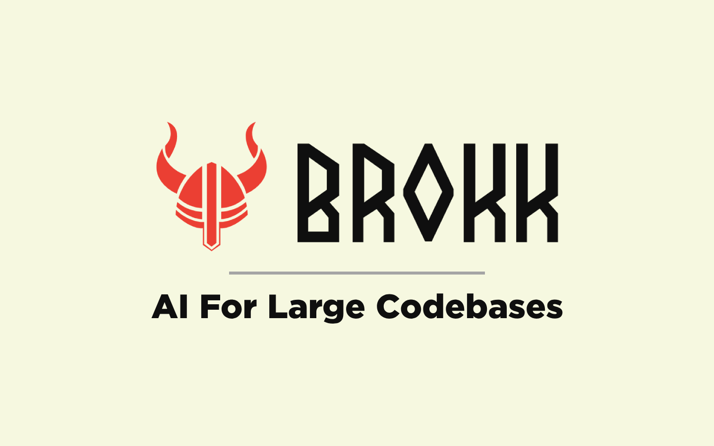

  

  <a href="https://brokk.ai">Website</a> •
  <a href="https://brokk.ai/documentation/introduction">Docs</a> •
  <a href="https://discord.com/invite/qYQ2Zg2PX7">Discord</a> •
  <a href="https://blog.brokk.ai">Blog</a> •
  <a href="https://www.youtube.com/@Brokk_AI">YouTube</a> •
  <a href="#getting-started">Getting Started</a>

  
  
  
  
  
  
  

# Brokk — AI-native code platform for million-line repos

Brokk keeps LLMs on-task in large codebases by curating fragment-level context and, with agentic Lutz Mode, gathering, pruning, and explaining decisions for fast, transparent coding.

   prune -> note/discard -> workspace ready" width="1080">

## Why Brokk is different

- **Fragment-level context, not file blobs**
  - Classes, methods, summaries, stack traces, URLs, images, notes, and discard records are first-class fragments.

- **Agentic Lutz Mode**
  - ContextAgent collects; SearchAgent expands and prunes; the Workspace becomes working memory. Keep/Forget/Note decisions are explicit and traceable.

- **Built for enterprise scale**
  - Dependency decompilation to source, incremental Java compiler for a tight edit-compile-test loop, BlitzForge mass refactors, and MergeAgent for conflict resolution.

# Contributing

Brokk uses Gradle with Scala support. To build Brokk,
1. Ensure you have JDK 21 or newer. Note the JetBrains Runtime is the preferred JDK.
2. Run Gradle commands directly: `./gradlew <command>`
3. Available commands: `run`, `test`, `build`, `shadowJar`, `tidy`, etc.

The frontend uses **pnpm** for package management. Gradle automatically handles pnpm installation and dependency management during builds.

## Increasing JVM heap when running via Gradle

When running Brokk from source with Gradle, increase the application JVM heap using standard `-Xmx` flags. The recommended approach is to set `JAVA_TOOL_OPTIONS` so the setting is inherited by the forked application JVM.

Examples:
- macOS/Linux:
  - `JAVA_TOOL_OPTIONS="-Xmx8G" ./gradlew run`
  - Or:
    - `export JAVA_TOOL_OPTIONS="-Xmx8G"`
    - `./gradlew run`
- Windows (PowerShell):
  - `$env:JAVA_TOOL_OPTIONS="-Xmx8G"; ./gradlew run`
- Windows (cmd.exe):
  - `set JAVA_TOOL_OPTIONS=-Xmx8G && gradlew run`

Notes:
- Do not use `-Dorg.gradle.jvmargs` or `GRADLE_OPTS` for application memory. These configure Gradle's own JVM and do not affect the forked application JVM.

There are documents on specific aspects of the code in [development.md](https://github.com/BrokkAi/brokk/tree/master/app/src/main/development.md).
