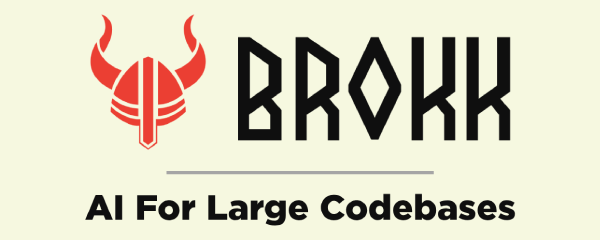

  

  <a href="https://brokk.ai">Website</a> •
  <a href="https://brokk.ai/documentation/introduction">Docs</a> •
  <a href="https://discord.com/invite/qYQ2Zg2PX7">Discord</a> •
  <a href="https://blog.brokk.ai">Blog</a> •
  <a href="https://www.youtube.com/@Brokk_AI">YouTube</a> •
  <a href="#getting-started">Getting Started</a>

  
  
  
  
  
  
  

  

# Brokk — AI-native code platform for million-line repos

Brokk keeps LLMs on-task in large codebases by curating fragment-level context and, with agentic Lutz Mode, gathering, pruning, and explaining decisions for fast, transparent coding.

   prune -> note/discard -> workspace ready" width="1080">

## Why Brokk is different

- **Fragment-level context, not file blobs**
  - Classes, methods, summaries, stack traces, URLs, images, notes, and discard records are first-class fragments.

- **Agentic Lutz Mode**
  - ContextAgent collects; SearchAgent expands and prunes; the Workspace becomes working memory. Keep/Forget/Note decisions are explicit and traceable.

- **Built for enterprise scale**
  - Dependency decompilation to source, incremental Java compiler for a tight edit-compile-test loop, BlitzForge mass refactors, and MergeAgent for conflict resolution.

## Brokk Power Ranking (BPR)

The Brokk Power Ranking is an open benchmark of 93 real-world coding tasks drawn from large Java repositories.

- Public results and methodology: https://brokk.ai/power-ranking
- Measures how different models handle long, messy, real tasks with full edit-and-test loops.

In the Brokk app, a BPR meter appears above the Instructions panel (for example, "BPR: 93%") and adapts to:
- the model you selected
- the current context size for the task

This gives a quick "fitness for this task" indicator so you can choose the best cost/performance model before you start the coding loop.

  

## How it works (20 seconds)

1. Describe your goal or question in natural language.
2. ContextAgent pulls in the minimal set of relevant fragments: classes, methods, summaries, tests, stack traces, URLs, and images.
3. SearchAgent expands and prunes the Workspace, discarding irrelevant fragments and promoting key details into Notes.
4. Brokk edits code and runs builds/tests in a tight loop, feeding failures and diffs back to the model.
5. You review, commit, branch, and reuse sessions with full visibility into what the AI saw and changed.

## Highlights

- **Context Engineering**
  - Fragment-level context: summaries, classes, methods, functions, images, markdown, URLs, stack traces, notes, and discard-context fragments.
  - Search Agent: symbol-, type-, and structure-aware search that understands usage patterns across the project and dependencies.

- **Workspace & Preview**
  - Workspace as working memory: Keep/Forget/Note operations with explicit, inspectable history.
  - Preview windows with search, quick edits, and promotion of selections into first-class fragments.

- **Git Integration**
  - Capture diffs, commits, and PRs as context; generate on-the-fly diffs for regressions.
  - First-class Git worktrees for parallel task branches and fast context switching.

- **Edit Loop**
  - Automatic compile/lint after code changes via an incremental Java compiler.
  - Run tests from the Workspace; failures are streamed directly back to the LLM.

- **BlitzForge**
  - Apply instructions across dozens or hundreds of files in parallel, with per-file context and a final holistic pass.

- **MergeAgent**
  - Resolve conflicts using blame-aware strategies that preserve intent from both sides with minimal manual editing.

- **Issue Tracker Integration**
  - Pull GitHub/Jira issues, comments, and images into structured context fragments inside Brokk.

- **Dependency Intelligence**
  - Decompile libraries to Java source so the model sees the exact APIs and versions used in your project.

- **Session & History**
  - Sessions with full action history, undo/redo, branching, and copying of workspaces so nothing is a black box.

# Contributing

Brokk uses Gradle with Scala support. To build Brokk,
1. Ensure you have JDK 21 or newer. Note the JetBrains Runtime is the preferred JDK.
2. Run Gradle commands directly: `./gradlew <command>`
3. Available commands: `run`, `test`, `build`, `shadowJar`, `tidy`, etc.

The frontend uses **pnpm** for package management. Gradle automatically handles pnpm installation and dependency management during builds.

## Increasing JVM heap when running via Gradle

When running Brokk from source with Gradle, increase the application JVM heap using standard `-Xmx` flags. The recommended approach is to set `JAVA_TOOL_OPTIONS` so the setting is inherited by the forked application JVM.

Examples:
- macOS/Linux:
  - `JAVA_TOOL_OPTIONS="-Xmx8G" ./gradlew run`
  - Or:
    - `export JAVA_TOOL_OPTIONS="-Xmx8G"`
    - `./gradlew run`
- Windows (PowerShell):
  - `$env:JAVA_TOOL_OPTIONS="-Xmx8G"; ./gradlew run`
- Windows (cmd.exe):
  - `set JAVA_TOOL_OPTIONS=-Xmx8G && gradlew run`

Notes:
- Do not use `-Dorg.gradle.jvmargs` or `GRADLE_OPTS` for application memory. These configure Gradle's own JVM and do not affect the forked application JVM.

There are documents on specific aspects of the code in [development.md](https://github.com/BrokkAi/brokk/tree/master/app/src/main/development.md).
